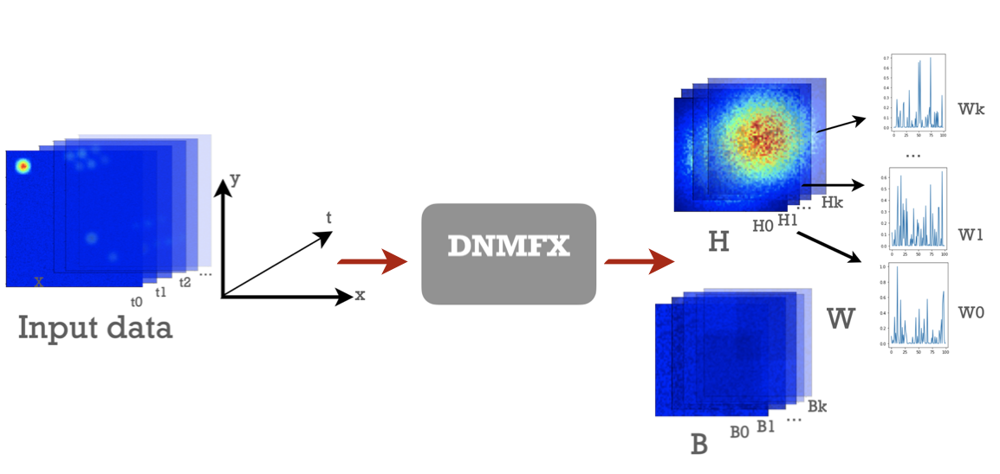

## Distributed SGD Non-negative Matrix Factorization (DNMFX) with JAX
### About DNMFX
DNMFX is a distributed algorithm based on stochastic gradient descent non-negative matrix factorization to be applied on reconstructing fluorescent cell components (`H`), their activity traces (`W`), and the background of where the cells locate (`B`). DNMFX optimizes `H`, `W`, `B`, such that

$$X[t, s] ≈ W[t, k]H[k, s] + 1[t, k] B[k, s] = \hat{X}[t, s]$$

where $X$ is input imaging data and $\hat{X}$ is its reconstruction; $k$ is the number of cell components in input data; $t$ is the number of time frames; $s$ is the size of (cell) components.



### Setup
To install DNMFX and its dependencies, run:
```py
pip install dnmfx
```
```py
pip install -r requirements.txt
```

### Usage
#### preparing input data

The input data belongs to the `Dataset` class with the following attributes that you may choose to define.


**`components`** *(required)*: stores the value of components in an array-like data structure of shape `(k, y, x)`, where `k` is the total number of components.

**`traces`** *(required)*: stores the activity trace of each component across all time frames available in an array-like data structure of shape `(k, t)`, where t is the number of time frames, k as defined above.

**`bounding_boxes`** *(required)*: `bounding_boxes` is a list of `funlib.geometry.Roi`. It stores information about the box that defines the approximate region each component occupies on the input data. Each `bounding_box` has a `component` it belongs to, so the indices of elements in `bounding_boxes` have one-to-one correspondence to each element from `components`.  You can define and access bounding boxes using member functions in `funlib.geometry.Roi`.

```py
import funlib.geometry as fg

# define bounding box center and size
y, x = 10, 20
box_size = 64
bb = fg.Roi((y, x), (box_size, box_size))

# access box information example calls
box_shape = bounding_box.get_shape()
box_size = bounding_box.get_size()
box_slices = bounding_box.get_bounding_box()
```

**`background`** *(optional)*: stores the static background image of the input data in an array-like data structure of shape `(w, h)`, where `w` is the image width; `h` is the image height.

**`noises`** *(optional)*: stores the noise from each time frame in an array-like data structure of shape `(t, w, h)`, `t`, `w`, and `h` as defined above.

**`sequence`** *(optional)*: stores the complete data obtained from assembling `components`, `traces`, `bounding_boxes`, `background` (if any), `noises` (if any) with one function call of  `dataset.render()`.

```py
from dnmfx.Dataset import Dataset

sequence = mydataset.render()
```

You can also read dataset from a path and write your own dataset:

```py
# read dataset from zarr container path

from dnmfx.io import read_dataset

dataset_path = 'datasets/toy_data_20220726.zarr'
toy_data = read_dataset(dataset_path)
components = toy_data.components
traces = toy_data.traces

# write your own dataset to disk

from dnmfx.io import write_dataset
from dnmfx.dataset import Dataset

dataset_path = 'datasets/mydata.zarr'

mydata = Dataset()
mydata.components = generate_components()
mydata.traces = generated_traces()
mydata.bounding_boxes = generate_bounding_boxes()
mydata.background = generate_background()
mydata.noises = generate_noises()

write_datast(mydata, dataset_path)
```

#### fitting on the input data

To reconstruct the input data by optimizing `H`, `W`, `B`, all we need is one function call to `fit`.

```py
from dnmfx.fit import fit

H, W, B, log = fit(dataset_path,
                   max_iteration,
                   min_loss,
                   batch_size,
                   step_size,
                   l1_weight,
                   log_every,
                   log_gradients,
                   random_seed)
```

**`dataset_path`** *(string, required)*: path to the zarr container containing the dataset. The dataset should have a `sequence` dataset of shape `(t, z, y, x)`. To construct `sequence`, see [preparing the input data](#preparing the input data).

**`max_iteration`** *(int, default=10000)*: the maximum number of iterations. If hit, fitting terminates and the current optimization results are returned.

**`min_loss`** *(float, default=1e-3)*: the minimum reconstruction loss. If reaches, fitting terminates and the current optimization results are returned.

**`batch_size`** *(int, default=10)*: number of time frames within a batch.

**`step_size`** *(float, default=1e-1)*: size of update that DNMFX takes at each iteration.

**`l1_weight`** *(float, default=0)*: parameter for regularizing; how much penalty to give for component and trace loss.

**`log_gradients`** *(boolean, default=False)*: whether or not to log the gradients at the first iteration (may be useful for testing).

**`random_seed`** *(int, default=None)*: random seed for producing reproducible results. If set to `None`, the algorithm uses the current time as seed.

#### evaluating the fitting results

To evaluate the optimization results, you can call `evaluate` to get the reconstruction error per pixel and the difference image between reconstruction and input data if you choose.

```py
from dnmfx.evaluate import evaluate

reconstruction_error, diff_image = evaluate(H, W, B,
                                            sequence, 
                                            show_diff=True)
```
### Full pipeline on synthetic data

Here is our synthetic data in this example:

```py
from dnmfx.io import read_dataset
from dnmfx.fit import fit
from dmfx.evaluate import evaluate

dataset_path = 'datasets/toy_data_20220726.zarr'

dataset = read_dataset(dataset_path)
sequence = dataset.sequence

H, W, B, log = fit(dataset_path,
                   max_iteration=1000000,
                   random_seed=2022)

reconstruction_error, diff_image = evaluate(H, W, B,
                                            sequence,
                                            show_diff=True)
```
Let's plot our reconstruction and compare it with the known ground truth!

```py
##TODO: copy the plot function over
```